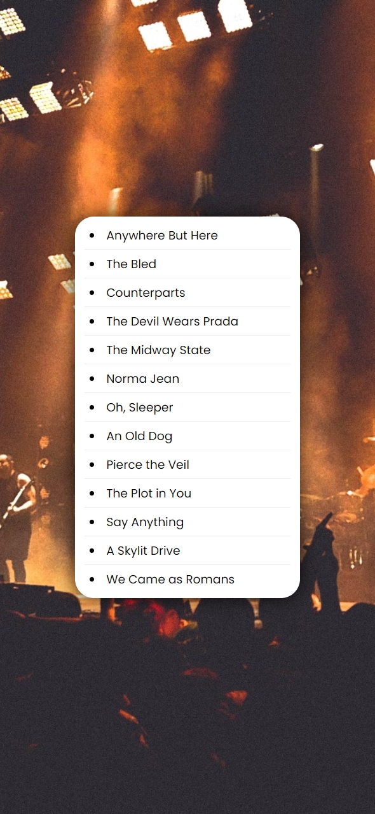

# Sorting Band Names without Articles

A simple web application that sorts band names alphabetically, excluding common articles (such as "A", "An", and "The") from the sorting process. This project demonstrates how to manipulate and display lists dynamically using JavaScript, HTML, and CSS.

## Description

This project features a webpage that displays a list of band names, sorted alphabetically, without considering articles like "A", "An", and "The" at the beginning of the names. The list is styled in a clean and modern layout, utilizing CSS Flexbox for responsiveness. The JavaScript dynamically handles the sorting logic by stripping articles from the band names before sorting them.

## Features

- Sorts band names alphabetically while excluding common articles like "A", "An", and "The".
- Interactive and visually appealing list layout with subtle hover effects.
- Responsive design using Flexbox and CSS for mobile-first layouts.
- Simple and lightweight, designed to be easily expandable or adapted for other use cases.
- Modern styling using Google Fonts (Poppins) and smooth visual effects.

## Technologies Used

- HTML
- CSS
- JavaScript

## How to Run

1. Clone the repository to your local machine.
2. Open `index.html` in your web browser.
3. Alternatively, you can view the live project on GitHub Pages: [Sorting Band Names on GitHub Pages](https://deannamandarino.github.io/sorting-band-names/).

## Acknowledgments

This project was completed as part of the JavaScript30 course. Special thanks to Wes Bos for the excellent resources and guidance throughout the course.